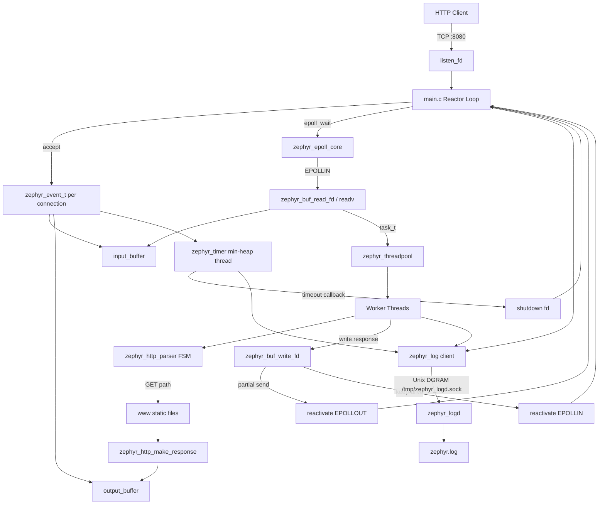
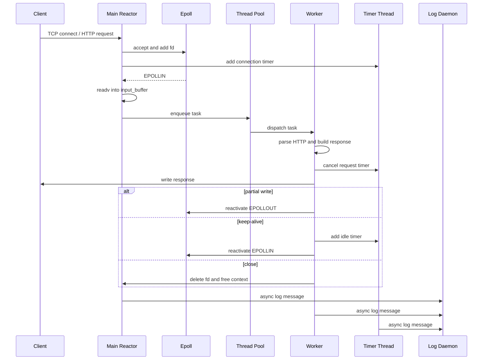

# Zephyr 项目文档

Zephyr 是一个使用 C 语言实现的轻量级高性能 HTTP 静态文件服务器。项目核心采用 Reactor 事件驱动模型：主线程负责 `accept`、`epoll_wait` 和非阻塞 I/O，业务处理由自适应线程池执行；同时配套了连接超时定时器、异步日志守护进程、动态缓冲区、HTTP 状态机解析器和泛型环形任务队列。

## 项目特性

- 基于 Linux `epoll` 的事件驱动服务器。
- 使用边缘触发 `EPOLLET`、非阻塞 socket 和 `EPOLLONESHOT` 控制并发派发。
- 主线程读取网络数据，worker 线程解析 HTTP 请求、读取静态文件并组装响应。
- 自适应线程池支持按负载扩缩容，任务队列基于环形队列实现。
- 动态 Buffer 使用 `readv` 双缓冲读取，支持请求半包和响应部分发送。
- HTTP 解析器使用有限状态机，支持 GET、keep-alive、静态文件服务、MIME 类型识别和基础目录遍历防护。
- 定时器模块使用最小堆和独立线程实现连接超时管理。
- 日志系统通过 Unix Domain Socket Datagram 将业务日志异步发送给独立日志守护进程。

## 目录结构

```text
.
├── Makefile
├── main.c                         # 服务器主入口，Reactor 主循环
├── INTERVIEW.md                   # 面试题库和模块讲解
├── include/
│   ├── queue.h                    # 泛型环形队列接口
│   ├── zephyr_buffer.h            # 动态 I/O 缓冲区接口
│   ├── zephyr_epoll_core.h        # epoll 封装和连接上下文
│   ├── zephyr_http_parser.h       # HTTP 解析和响应接口
│   ├── zephyr_log.h               # 日志客户端接口
│   ├── zephyr_threadpool.h        # 动态线程池接口
│   └── zephyr_timer.h             # 定时器接口
├── src/
│   ├── queue.c                    # 环形队列实现
│   ├── zephyr_buffer.c            # Buffer、readv、write 实现
│   ├── zephyr_epoll_core.c        # epoll create/add/mod/del/wait 封装
│   ├── zephyr_http_parser.c       # HTTP FSM、静态文件响应
│   ├── zephyr_log.c               # 日志客户端
│   ├── zephyr_logd.c              # 日志守护进程
│   ├── zephyr_threadpool.c        # worker/admin 线程池
│   └── zephyr_timer.c             # 最小堆定时器
├── www/
│   └── index.html                 # 默认静态页面
└── bin/
    ├── zephyr                     # 构建后的服务器二进制
    └── zephyr_logd                # 构建后的日志守护进程二进制
```

## 构建与运行

项目依赖 Linux、GCC、pthread 和 epoll。

```bash
make
```

启动日志守护进程：

```bash
make logd
```

启动服务器：

```bash
make run
```

访问默认页面：

```bash
curl http://127.0.0.1:8080/
```

停止日志守护进程：

```bash
make logd-stop
```

清理构建产物和临时 socket/pid 文件：

```bash
make clean
```

## 总体架构




## 请求处理链路

1. `main.c` 创建监听 socket，绑定 `0.0.0.0:8080`，设置非阻塞。
2. 监听 fd 被加入 epoll，使用 `EPOLLIN | EPOLLET`。
3. 新连接到来后，主循环循环 `accept` 直到 `EAGAIN`。
4. 每个客户端连接创建一个 `zephyr_event_t`，内部包含 fd、epoll fd、输入 Buffer、输出 Buffer、业务回调、keep-alive 状态和定时器 ID。
5. 客户端 fd 通过 `zephyr_epoll_add` 加入 epoll，默认启用 `EPOLLIN | EPOLLET | EPOLLRDHUP | EPOLLONESHOT`。
6. 主线程在 `EPOLLIN` 时调用 `zephyr_buf_read_fd`，使用 `readv` 将数据读入连接专属输入 Buffer。
7. 读取成功后，主线程向线程池投递 `task_t`，worker 执行 `http_business_handler`。
8. worker 调用 HTTP 状态机解析请求行和请求头。
9. 解析完成后取消新连接超时定时器，根据 URL 从 `www/` 读取静态文件并组装 HTTP 响应。
10. 响应数据写入输出 Buffer，并通过 `zephyr_buf_write_fd` 尝试发送。
11. 如果响应未发完，则重新激活 `EPOLLOUT`；如果 keep-alive，则重新激活 `EPOLLIN` 并设置空闲超时；否则关闭连接并释放资源。

## 核心模块说明

### Reactor 主循环

位置：`main.c`

主循环负责系统装配和事件派发。它初始化日志客户端、定时器、线程池、epoll 实例和监听 socket。运行期间按事件类型分流：

- `listen_fd` 可读：循环接收新连接。
- 客户端异常：清理连接和 Buffer。
- `EPOLLOUT`：继续发送未完成响应。
- `EPOLLIN`：读取数据并投递业务任务。

该设计将网络事件管理集中在主线程，同时通过 `EPOLLONESHOT` 避免同一连接被多个 worker 并发处理。

### Epoll 封装

位置：`src/zephyr_epoll_core.c`

该模块封装 `epoll_create`、`epoll_ctl` 和 `epoll_wait`。客户端 fd 被强制设置为非阻塞，并统一使用：

```text
EPOLLIN | EPOLLET | EPOLLRDHUP | EPOLLONESHOT
```

worker 完成一次处理后，必须调用 `zephyr_epoll_reactivate` 重新激活事件。

### 动态 Buffer

位置：`src/zephyr_buffer.c`

Buffer 使用 `data`、`capacity`、`read_idx`、`write_idx` 描述三段空间：

```text
[0, read_idx)           已消费
[read_idx, write_idx)   可读有效数据
[write_idx, capacity)   可写空闲空间
```

读取使用 `readv`：

- 第一段直接写入 Buffer 剩余空间。
- 第二段使用栈上 `extrabuf[65536]` 接收溢出数据。
- 如果发生溢出，则 `realloc` 扩容后拷贝回 Buffer。

写出使用非阻塞 `write`，返回值协议区分发送成功、无数据、`EAGAIN` 和致命错误。

### HTTP 解析器

位置：`src/zephyr_http_parser.c`

解析器使用有限状态机：

```text
PARSE_REQUESTLINE -> PARSE_HEADERS -> PARSE_BODY -> PARSE_PARSE_DONE
```

当前实现主要面向静态 GET 请求：

- `/` 自动映射到 `/index.html`。
- 仅支持 `GET`，其他方法返回 `405`。
- URL 中包含 `..` 返回 `400`，防止目录遍历。
- 文件不存在返回 `404`。
- 根据扩展名生成常见 MIME 类型。
- 根据 HTTP 版本和 `Connection` 头维护 keep-alive 状态。

### 线程池

位置：`src/zephyr_threadpool.c`

线程池由 worker 线程、admin 管理线程和任务队列组成。初始创建 `MIN_FREE_NR` 个 worker，最多扩展到 `MAXJOB` 个线程。admin 线程每秒检查负载：

- 当忙碌线程数等于存活线程数且未达上限时，每次最多扩容 `STEP` 个线程。
- 当空闲线程超过 `MAX_FREE_NR` 且存活线程高于保底线时，唤醒空闲线程退出。

任务队列使用 `queue_t` 环形队列，线程安全由线程池互斥锁和条件变量保证。

### 定时器

位置：`src/zephyr_timer.c`

定时器使用最小堆管理到期时间，独立线程通过条件变量等待最近到期任务。插入、取消和统计接口均受互斥锁保护。

服务器中有两类连接定时：

- 新连接超时：`CONN_TIMEOUT_MS = 30000`，要求客户端 30 秒内发送完整请求。
- keep-alive 空闲超时：`KEEPALIVE_IDLE_MS = 10000`，响应完成后 10 秒无新请求则关闭。

超时回调只标记 `timed_out` 并调用 `shutdown(fd, SHUT_RDWR)`，实际资源释放交给主循环，降低跨线程释放连接对象的风险。

### 日志系统

位置：`src/zephyr_log.c`、`src/zephyr_logd.c`

日志客户端在业务进程内运行，通过 Unix Domain Socket Datagram 向 `/tmp/zephyr_logd.sock` 非阻塞发送日志。发送失败时静默丢弃，避免日志系统拖慢主业务。

日志守护进程 `zephyr_logd` 是独立二进制，负责：

- 绑定 Unix Domain Socket。
- 接收日志消息并写入 `zephyr.log`。
- 支持前台运行或 daemon 模式。
- 支持按大小轮转日志文件。
- 支持 `SIGHUP` 重新打开日志文件。

## 关键数据结构

### zephyr_event_t

`zephyr_event_t` 是每个客户端连接的上下文对象，挂载在 `epoll_event.data.ptr` 上。它把 fd、Buffer、业务回调、连接状态和定时器 ID 组织在一起，是主线程、worker 线程和定时器线程之间共享连接状态的核心结构。

### queue_t

`queue_t` 是泛型环形队列。实现上额外保留一个空槽，用 `front == rear` 表示空，用 `(rear + 1) % capacity == front` 表示满。队列本身不加锁，由线程池在外层保证并发安全。

## 并发模型



## 当前限制与可改进方向

- HTTP 解析只覆盖静态 GET，请求体和复杂 header 处理较简化。
- 静态文件读取使用普通 `read` 拷贝到用户态 Buffer，可进一步使用 `sendfile` 或 mmap 优化。
- `readv` 的栈上溢出缓冲区为 64KB，极端大请求仍需要更完整的循环读取策略和请求大小限制。
- 定时器上限为 `TIMER_MAX = 256`，但线程池队列容量和 epoll 事件上限更高，高并发 keep-alive 场景下需要统一容量规划。
- `zephyr_event_t` 在 timer、main、worker 间共享，当前通过 `EPOLLONESHOT` 和轻量标志降低竞态，但若扩展复杂状态，建议引入更明确的生命周期管理。
- 日志客户端在守护进程不可用时丢弃日志，适合性能优先场景；如果需要审计可靠性，可增加本地缓冲或降级文件输出。
- 当前没有单元测试和压测脚本，可补充 parser、buffer、queue、timer 的模块测试，以及 wrk/ab 压测说明。

## 推荐阅读顺序

1. `main.c`：理解整体启动流程和 Reactor 主循环。
2. `include/zephyr_epoll_core.h`、`src/zephyr_epoll_core.c`：理解连接上下文与 epoll 策略。
3. `src/zephyr_buffer.c`：理解非阻塞 I/O、半包和部分发送。
4. `src/zephyr_http_parser.c`：理解 HTTP 解析和响应构造。
5. `src/zephyr_threadpool.c`：理解任务调度和动态扩缩容。
6. `src/zephyr_timer.c`：理解连接超时管理。
7. `src/zephyr_log.c`、`src/zephyr_logd.c`：理解异步日志链路。
